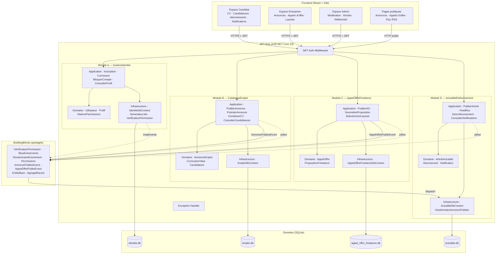

# CVTech — Plateforme de Recrutement Tech

Monolithe modulaire .NET 10, DDD, MediatR, EF Core SQLite, frontend React + Vite + TypeScript.

---

## Architecture



---

## Prérequis

- .NET SDK 10.0.x
- Node.js 18+ / npm 9+
- (Optionnel) `dotnet-ef` : `dotnet tool install --global dotnet-ef`

---

## Lancement pas à pas

### 1. Restaurer et compiler le backend

```bash
cd CVTech
dotnet restore
dotnet build
```

### 2. Lancer l'API

```bash
dotnet run --project src/Api/CVTech.Api
```

L'API démarre sur `http://localhost:5298` (ou le port affiché).  
Les migrations EF Core et les données de seed s'appliquent automatiquement au premier démarrage.

### 3. Lancer le frontend

Dans un second terminal :

```bash
cd frontend
npm install
npm run dev
```

Le frontend démarre sur `http://localhost:5173`.

---

## Comptes de seed

| Rôle | Email | Mot de passe |
|------|-------|--------------|
| Administrateur | `admin@cvtech.fr` | `Admin1234!` |
| Entreprise | `techcorp@cvtech.fr` | `Entreprise1!` |
| Candidat | `candidat@cvtech.fr` | `Candidat1!` |

---

## Tests

```bash
dotnet test
```

**80 tests — 0 échec** :
- GestionIdentite : 44 tests (matrice de permissions, JWT, compte bloqué)
- CatalogueEmploi : 17 tests (permissions, émission d'événement, accès public)
- AppelOffreFreelance : 12 tests (propriété, sélection lauréat, modération)
- ActualiteEtAbonnement : 7 tests (RSS, abonnement → notification)

---

## Flux RSS

```bash
curl http://localhost:5298/feed/rss
```

Renvoie du XML RSS 2.0 contenant uniquement les articles éditoriaux.  
Filtrable par domaine : `curl "http://localhost:5298/feed/rss?domaine=dev-web"`

---

## Démo du flux de notification

1. Se connecter en tant que **Candidat** (`candidat@cvtech.fr`)
2. Espace Candidat → onglet **Abonnements** → s'abonner au domaine `dev-web`
3. Se connecter en tant qu'**Entreprise** (`techcorp@cvtech.fr`)
4. Espace Entreprise → **Publier une annonce** avec le domaine `dev-web`
5. Se reconnecter en tant que **Candidat**
6. Espace Candidat → onglet **Notifications** : la notification apparaît

Le log de l'API affiche également une ligne `[EMAIL] Notification envoyée à candidat@cvtech.fr`.

---

## Structure du projet

```
CVTech/
├── src/
│   ├── BuildingBlocks/CVTech.BuildingBlocks/   # Contrats partagés
│   ├── Modules/
│   │   ├── GestionIdentite/CVTech.GestionIdentite/
│   │   ├── CatalogueEmploi/CVTech.CatalogueEmploi/
│   │   ├── AppelOffreFreelance/CVTech.AppelOffreFreelance/
│   │   └── ActualiteEtAbonnement/CVTech.ActualiteEtAbonnement/
│   └── Api/CVTech.Api/                          # Composition root
├── tests/
│   ├── CVTech.GestionIdentite.Tests/
│   ├── CVTech.CatalogueEmploi.Tests/
│   ├── CVTech.AppelOffreFreelance.Tests/
│   └── CVTech.ActualiteEtAbonnement.Tests/
├── frontend/                                    # React + Vite + TypeScript
└── .agent/skills/                               # Fichiers de compétences IA
    ├── architecture-monolithe.md
    ├── regles-permissions.md
    └── regles-tdd.md
```

---

## Matrice de permissions (résumé)

| Action | Candidat | Entreprise | Admin |
|--------|----------|------------|-------|
| Publier annonce | ✗ | ✓ | ✓ |
| Postuler à une annonce | ✓ | ✗ | ✗ |
| Constituer son CV | ✓ | ✗ | ✗ |
| Consulter les candidatures reçues | ✗ | ✓ (propres) | ✓ |
| Modérer une annonce | ✗ | ✗ | ✓ |
| Publier appel d'offre | ✗ | ✓ | ✓ |
| Soumettre une proposition | ✓ | ✗ | ✗ |
| Sélectionner un lauréat | ✗ | ✓ (propre AO) | ✓ |
| Gérer abonnements | ✓ | ✗ | ✗ |
| Publier article éditorial | ✗ | ✗ | ✓ |
| Gérer référentiel domaines | ✗ | ✗ | ✓ |
| Bloquer un compte | ✗ | ✗ | ✓ |
